# 👋 Hi, I'm Mohammad Muqtadi Al Saadi

### 💻 Aspiring Full-Stack Web Developer | 🌱 Currently Learning

I'm a beginner web developer passionate about building websites and web applications.
I'm currently learning modern web development step by step and improving my problem-solving and coding skills every day.

---

## 🚀 About Me

* 🌱 Currently learning **Full-Stack Web Development**
* 💻 Learning **JavaScript, TypeScript, React, Node.js, and Express.js**
* 🗄️ Exploring **MongoDB and PostgreSQL**
* 🔗 Learning **REST APIs and Git**
* ⚡ Interested in building real-world web applications
* 📚 Continuously improving my programming and problem-solving skills
* 🎯 Goal: Become a skilled **Full-Stack Web Developer**

---

## 🛠️ Technologies I'm Learning

### 💻 Frontend


### ⚙️ Backend


### 🗄️ Databases


### 🔧 Tools


---

## 📚 Currently Learning

```text
HTML & CSS
     ↓
JavaScript
     ↓
TypeScript
     ↓
React
     ↓
Node.js + Express.js
     ↓
REST APIs
     ↓
MongoDB + PostgreSQL
     ↓
Next.js
     ↓
Full-Stack Projects 🚀
```

I'm focusing on understanding the fundamentals first and then applying them by building projects.

---

## 🧩 What I'm Working On

* 🌐 Building responsive websites
* ⚛️ Learning React and reusable components
* 🟨 Improving JavaScript fundamentals
* 🔷 Practicing TypeScript
* 🟢 Learning backend development with Node.js
* 🚂 Exploring Express.js
* 🗄️ Working with databases
* 🔗 Building and consuming REST APIs
* 🌿 Learning Git and GitHub workflows
* 🚀 Building full-stack projects

---

## 📂 Featured Projects

### 🌐 DEVCONF 2026

A modern developer conference website featuring:

* 🎤 Speakers
* 🏷️ Conference tracks
* 💰 Pricing plans
* 🤝 Sponsors
* 📍 Venue information
* ❓ FAQ
* 📰 Newsletter signup
* 💼 Job board
* 🏆 Hackathon information

**Tech:** HTML • CSS • JavaScript

---

### 🚧 More Projects Coming Soon

I'm currently learning and building new projects.
This section will grow as I complete more full-stack applications.

---

## 📊 GitHub Stats

<p align="center">
  

  
</p>


---

## 🔥 GitHub Streak

<p align="center">
  
</p>

---

## 🎯 My Goals

```text
☑ Learn JavaScript deeply
☑ Learn TypeScript
☑ Build projects with React
☐ Master Node.js & Express.js
☐ Work with MongoDB & PostgreSQL
☐ Build REST APIs
☐ Learn Next.js
☐ Build complete full-stack applications
☐ Improve problem-solving skills
☐ Become a professional Full-Stack Developer
```

---

## 🤝 Connect With Me

<p align="left">
  <a href="mailto:mohammadmuqtadialsaadi@gmail.com">
    
  </a>
  <a href="https://www.instagram.com/stay_with_turjo/?hl=en">
    
  </a>
  <a href="https://www.facebook.com/al.saadi.turjo">
    
  </a>
  <a href="https://discord.com/users/smokey_turbo">
    
  </a>
</p>

---

## 💡 Developer Mindset

> **Learn → Build → Break → Debug → Improve → Repeat.**

I'm still at the beginning of my journey, but I'm committed to learning consistently, building real projects, and becoming a better developer every day.

---

### ⭐ Thanks for visiting my profile!

If you find any of my projects useful, feel free to ⭐ the repository.

**Happy Coding! 🚀**
